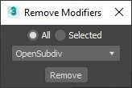
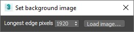
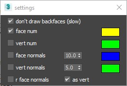
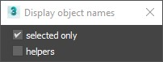

removeModifiers.ms
---
Batch remove modifiers from stack, can be used to list all modifier types applied to a set of objects.

setBackgroundImage.ms
---
Quick method to set up new environment map and viewport background image with correct aspect ratio.

selectNodesByMaterial.ms
---
Displays materials from the selected objects, allows to select the objects that depends on material.

drawMeshData.ms
---
Draws in viewport data from selected EditMesh objects, supports only objects with EditableMesh modifier.
+ vertex numbers, face numbers
+ vertex normals, face normals, rface normals

drawObjectNames.ms
---
Draws object names in viewport.

