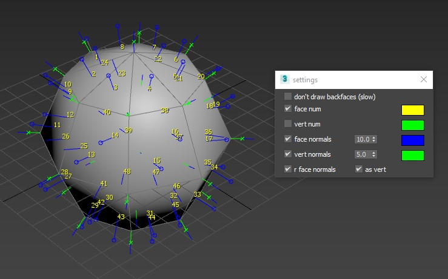

# utilities

setBackgroundImage.ms
-
Quick method to set up new environmentMap and viewport background image with correct aspect ratio

selectNodesByMaterial.ms
-
Displays materials from the selected objects, allows to select the objects that depends on material 

drawMeshData.ms
-
Draws realtime data from selected EditMesh objects, supports only objects with EditableMesh modifier 
+ vertex numbers, face numbers
+ vertex normals, face normals, rface normals 

